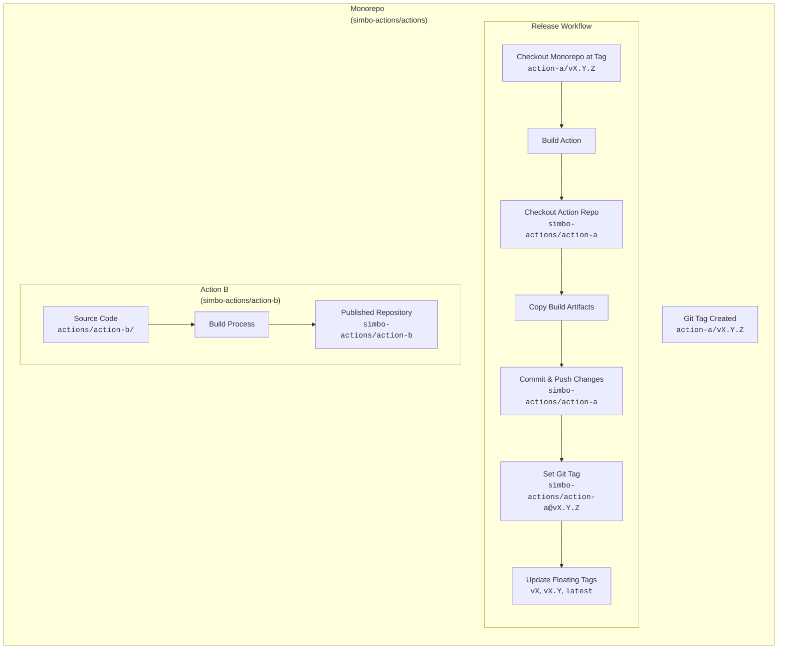

# 🔄 Simbo's Actions — Concept

The main goal of this monorepo setup is to develop all my GitHub Actions in a
centralized location while still publishing their build artifacts to separate
repositories.

## Key Features

- **Native GitHub Actions versioning experience:** Each action can be versioned
  independently by git tags, allowing users to specify version references like
  `@v1.2.3`, `@v1`, or `latest` when using the action in their workflows.

- **No build artifacts in this repository:** The monorepo only contains the
  source code of the actions. The built artifacts are published to their
  respective repositories, keeping this repository clean and focused on relevant
  source code.

- **Streamlined publishing:** Actions are published automatically to their
  respective repositories upon adding new changesets, simplifying the
  distribution process and lowering maintenance overhead.

## Requirements for Action Workspaces

To be compatible with the management and publishing process, each action
workspace must meet the following requirements:

- A `README.md` file documenting the action's purpose, usage, and examples.

- An `action.yml` file defining the action's metadata and inputs/outputs.

- A `package.json` file defining the action's workspace/package name, version,
  scripts, dependencies, etc. _(This is required even for non-Node.js actions to
  manage the workspace/package structure.)_

- If the action is implemented in JavaScript/TypeScript:
  - It should target Node.js 24 as the runtime environment.

### Scripts Called in Workflows

An action workspace's `package.json` may define the following scripts, which are
called in the workflows:

- `build` - builds the action's source code into a distributable format.
- `bundle` - run post-build bundling steps (e.g., copying additional files).
- `test` - runs tests for the action.
- `check` - run all other checks (linting, type checking, etc.).

### Build Artifacts Added to Published Repositories

The following files and directories are included in the published action
artifacts:

- `README.md`
- `action.yml`
- `package.json`
- `CHANGELOG.md` (automatically generated from changesets during releases)
- `LICENSE.md` (copied from the monorepo root)
- `dist/` directory (if exists after running `build` and `package` scripts)
